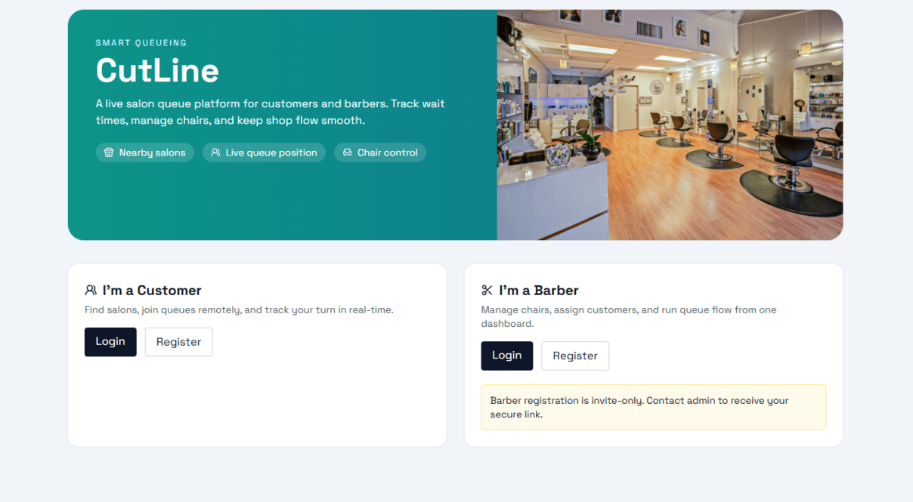

# CutLine

CutLine is a full-stack digital salon queue management system with two roles:

- Customer: discover nearby salons, join queue remotely, track live position
- Barber: manage chairs, assign next customer, mark done/no-show in real-time

## Tech Stack

- Frontend: React + Vite, Tailwind CSS, React Router v6, Axios, Socket.IO Client, React Hot Toast, Lucide
- Backend: Node.js, Express, Prisma, PostgreSQL, Redis, Socket.IO, JWT, bcrypt, Nodemailer

## Project Structure

- `client/` React app
- `server/` Express + Prisma + Socket.IO API

## Repository Scope

- Role-based platform for salon queue management (customer, barber, admin).
- Realtime updates for queue movement, chair state, and turn notifications.
- Invite-policy controlled barber onboarding.
- Image-backed salon profiles with ImageKit upload pipeline.

## Configuration Surface

- Backend configuration is documented in `server/.env.example`.
- Frontend configuration is documented in `client/.env.example`.
- Infrastructure reference exists in `docker-compose.yml` (PostgreSQL + Redis).
